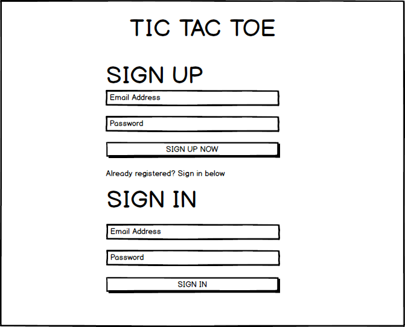
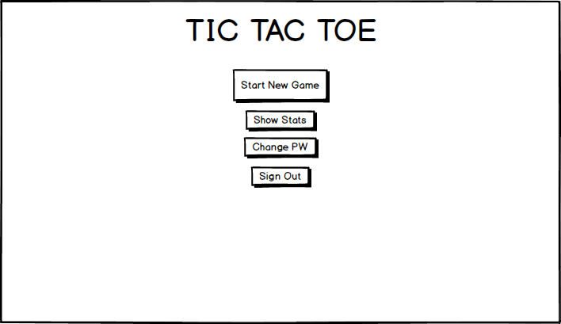
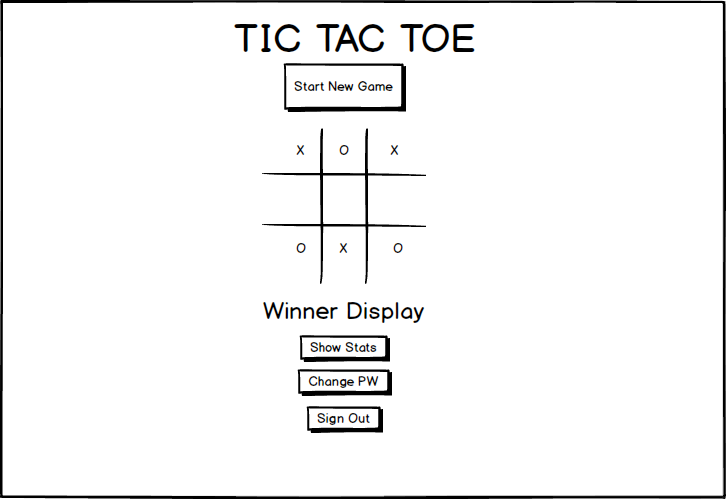

Welcome to tic-tac-toe, my first deployed application as a software engineer! This README will walk you through my development process & how the application works. Hope you enjoy :-)

### How the app works:
At the landing page, new users will be given the opportunity to sign up with an email address and password, and existing users will able to log in with their credentials. After signing in, users will be able to click a button to start a new game immediately, view their stats (retrieves total games played from an API), change their password, or sign out. After clicking the start a new game button, an AJAX request is made to the API creating a new game object, and the gameboard appears, with a display at the bottom showing whose turn it is (X always goes first). Players click the board to make their choice. With each click, an AJAX request is made to the API, updating an array that represents each selection made on the game board. Players alternate turns until the game is won with 3 in a row, or until the game ends with a tie. At any point, users can click the start new game button to reset the game board and start a new game.

### Development Process:

  * Review requirements documentation for big picture as well as detailed expectations for the project
  * Brainstorm and diagram out some of the core functions of the application and start thinking about how you will approach it.
  * Write out user stories and build a wireframe
  * Build the game board (HTML & CSS)
  * Get clicks to represent X's and O's on the board (jQuery)
  * Write the game logic (JavaScript conditional statements to check for the various possible winning scenarios and tie scenarios)
  * Interact with the API to create a game, update an array representing the various board positions with each click, and retrieve total games played. Also interact with the API to allow users to sign up, sign in, change password, and sign out. (AJAX, read API documentation)
  * Look for opportunities to make code DRY
  * Add basic styles
  * Work on stretch goals (time permitting)

### User Stories

  * First time users will want to create an account so they can access the game and keep track of their statistics
  * Returning users will want to log in so they can play the game
  * During gameplay, users will want to see whose turn it is
  * During gameplay, users will want the board to display their clicks as either Xs or Os
  * Users will want to have the ability to start a new game at any point without refreshing the page
  * Users will want to be able to log out at any time

### Wireframes

### Technologies Used:

  * HTML
  * CSS
  * Bootstrap
  * Javascript
  * jQuery

### Unsolved Problems

In terms of meeting the minimum requirements for the project, there were no unsolved problems. In future iterations, I would like to work on adding more features (e.g., play vs. computer, online multiplayer).
